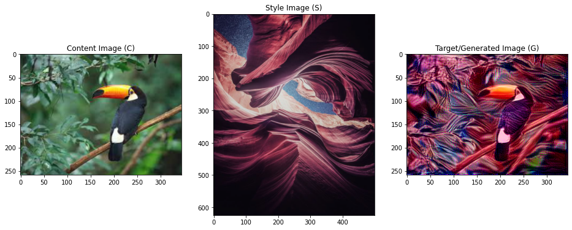

# Neural Style Transfer

Style Transfer is the task of taking the style (colors, textures etc.) of one image and applying it to another image while preserving its original content. In recent years Artificial Neural Networks (ANNs) are proving quite effective at this, outperforming previous hand crafted state of the art methods. Neural Style Transfer (NST) refers to using ANNs for style transfer tasks.

This is the final project for the CSCI6505: Machine Learning course at Dalhousie University.

**CSCI6505 Team 5 Members:**

- Ryan O'Neil
- Amit Baroi
- Sarthak Patel
- Piyush Menat
